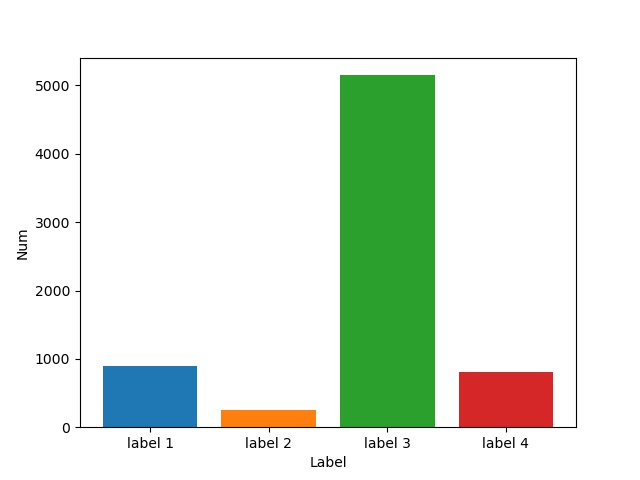
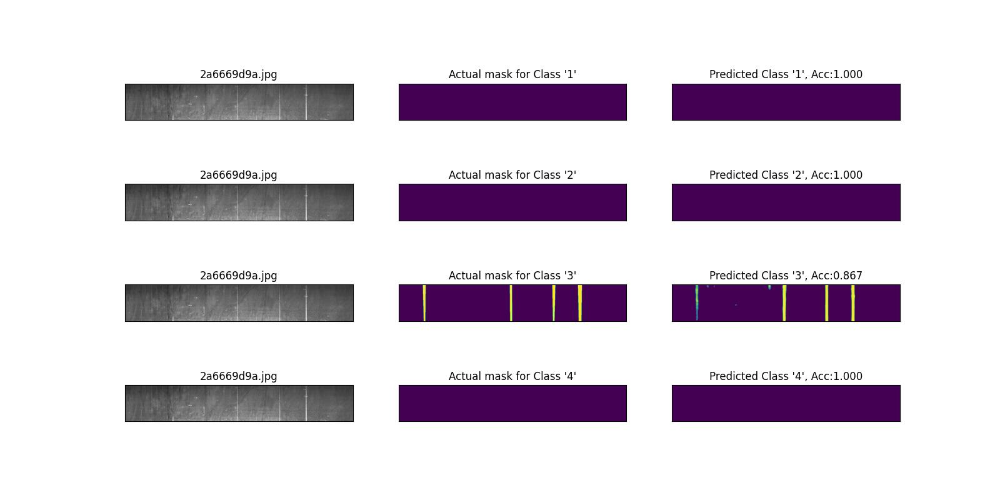
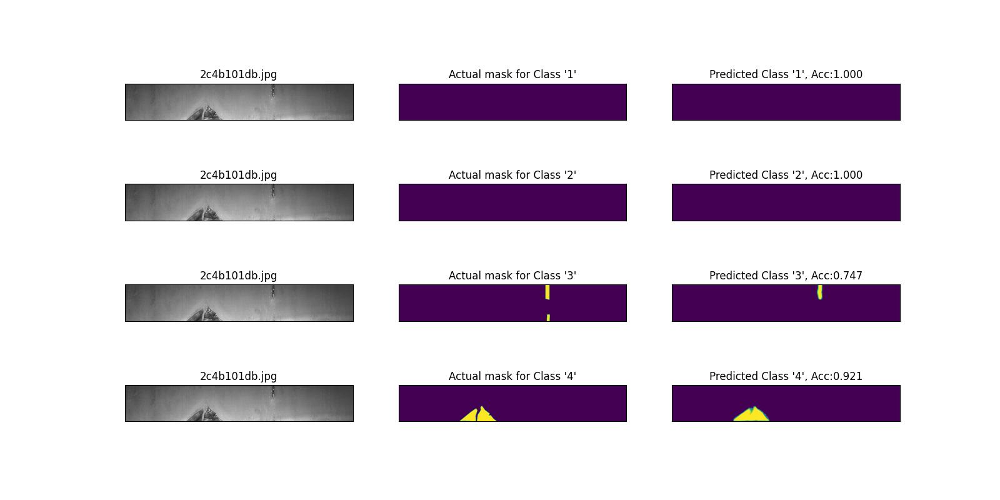
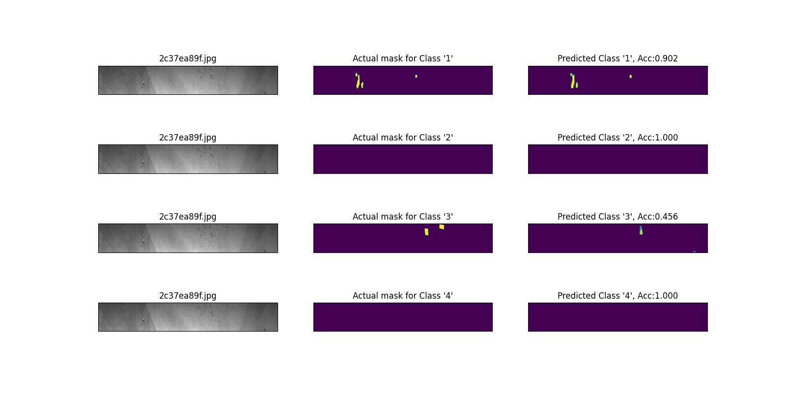

# Steel-Defect-Detection

此專案是Kaggle上的競賽，您可以從下方連結得到更詳細的比賽資訊  
https://www.kaggle.com/c/severstal-steel-defect-detection/overview

參考網路上的範例，並根據本身的裝置環境修改了資料及數量、模型參數與模型架構

## 資料集
從Kaggle下載的資料集總共有四個類別，從下圖可以知道類別之間的資料量不平均，且某些資料量明顯偏少。  


為了解決資料不平均的問題，我先做資料增強(data augmentation)，再將每種類別取差不多數量的數據做訓練，但準確率卻沒有明顯改善，最後做法為直接將資料增強後的數據全部作為training data。  

執行前兩個python檔後，會在名為data的資料夾下產生train, validation, test用的csv檔。  
最後一個指令是為了將csv的檔案做整理，因為有些圖片中含有多種類別，在csv中視分開表示，為了後續在計算準確率上更準確必須將資料作彙整。
```
python data_augmentation.py
python split_train_test_csv.py
python ground_truth_preprocessing.py
```

## 模型
在模型的選擇上採用Unet++做訓練，模型架構放在*modules.py*。  
如果結果沒有達到預期效果，您可以修改以下超參數來重新訓練您的模型 :
* n_filters
* dropout (或是把dropout關掉)
* learning rate
* batch size

另外，在計算loss上，上網查了資料發現使用下面的寫法才可以檢測多類別的問題
```python
def dice_coefficient(y_true, y_pred):
    sum1 = 2 * tf.math.reduce_sum(y_true * y_pred, axis=(0, 1, 2))
    sum2 = tf.math.reduce_sum(y_true**2 + y_pred**2, axis=(0, 1, 2))
    dice = sum1 / (sum2 + 1e-9)
    dice = tf.math.reduce_mean(dice)
    return dice
```

執行下面指令開始訓練模型
```
python main.py
```

## 結果
最後，我在超參數的使用如下，得到83%的準確率
* learning rate = 0.01
* batch size = 4
* dropout = none
* n_filters = 16
* loss = dice loss
* epochs = 100
---



